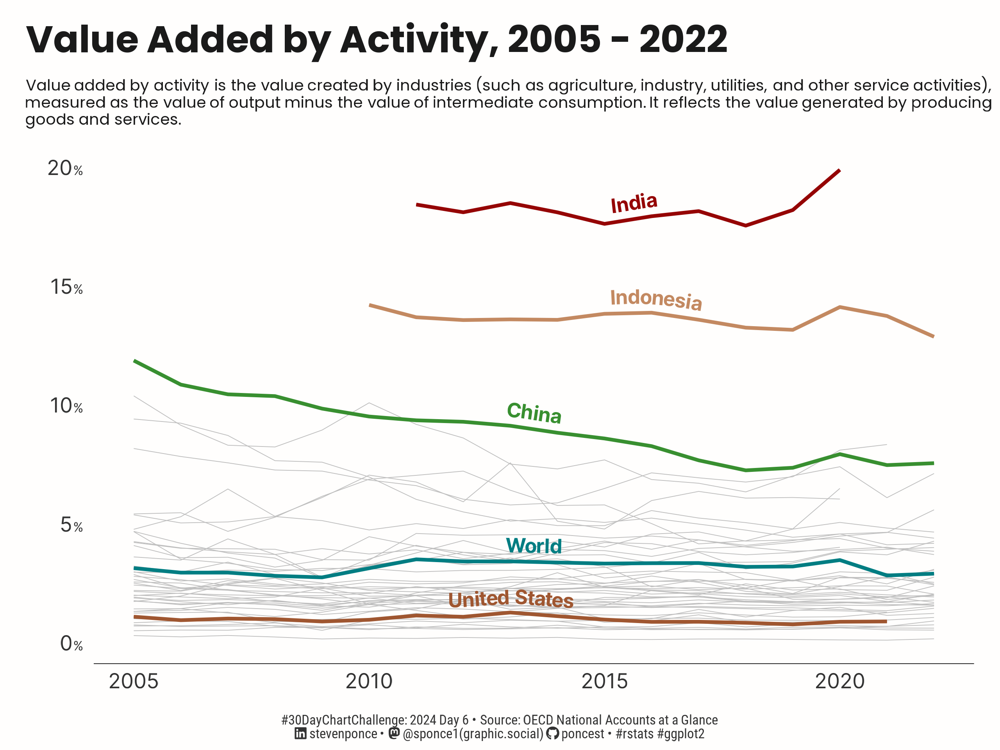

# #30DayChartChallenge

## 2024 - April (#rstats edition)

## Topics:

|                                                                                                                                                                                        |                                                                                                                                                                               |                                                                                                                                                                                    |                                                                                                                                                                                     |
|----------------------------------------------------------------------------------------------------------------------------------------------------------------------------------------|-------------------------------------------------------------------------------------------------------------------------------------------------------------------------------|------------------------------------------------------------------------------------------------------------------------------------------------------------------------------------|-------------------------------------------------------------------------------------------------------------------------------------------------------------------------------------|
| [Day 01](https://github.com/poncest/30DayChartChallenge/tree/main/2024/day_01) [Comparisons \| part-to-whole](https://github.com/poncest/30DayChartChallenge/tree/main/2024/day_01) | [Day 02](https://github.com/poncest/30DayChartChallenge/tree/main/2024/day_02) [Comparisons \| neo](https://github.com/poncest/30DayChartChallenge/tree/main/2024/day_02)  | [Day 03](https://github.com/poncest/30DayChartChallenge/tree/main/2024/day_03) [Comparisons \| makeover](https://github.com/poncest/30DayChartChallenge/tree/main/2024/day_03)  | [Day 04](https://github.com/poncest/30DayChartChallenge/tree/main/2024/day_04) [Comparisons \| waffle](https://github.com/poncest/30DayChartChallenge/tree/main/2024/day_04)     |
|                                                                                                                                             |                                                                                                                                              |                                                                                                                                                |                                                                                                                                                 |
| [Day 05](https://github.com/poncest/30DayChartChallenge/tree/main/2024/day_05) [Comparisons \| diverging](https://github.com/poncest/30DayChartChallenge/tree/main/2024/day_05)     | [Day 06](https://github.com/poncest/30DayChartChallenge/tree/main/2024/day_06) [Comparisons \| OECD](https://github.com/poncest/30DayChartChallenge/tree/main/2024/day_06) | [Day 07](https://github.com/poncest/30DayChartChallenge/tree/main/2024/day_07) [Distributions \| hazards](https://github.com/poncest/30DayChartChallenge/tree/main/2024/day_07) | [Day 08](https://github.com/poncest/30DayChartChallenge/tree/main/2024/day_08) [Distributions \| circular](https://github.com/poncest/30DayChartChallenge/tree/main/2024/day_08) |
|                                                                                                                                                 |                                                                                                                                             |                                                                                                                                               |                                                                                                                                               |
|                                                                                                                                                                                        |                                                                                                                                                                               |                                                                                                                                                                                    |                                                                                                                                                                                     |
|                                                                                                                                                                                        |                                                                                                                                                                               |                                                                                                                                                                                    |                                                                                                                                                                                     |
