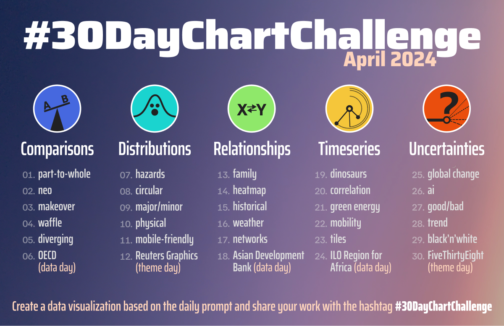
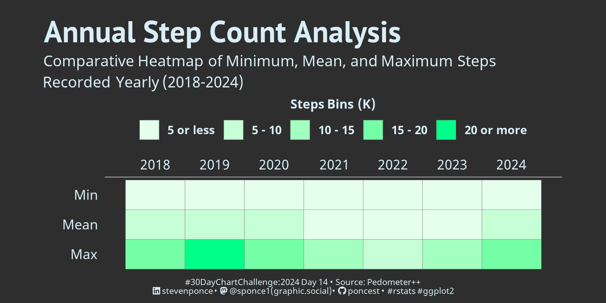
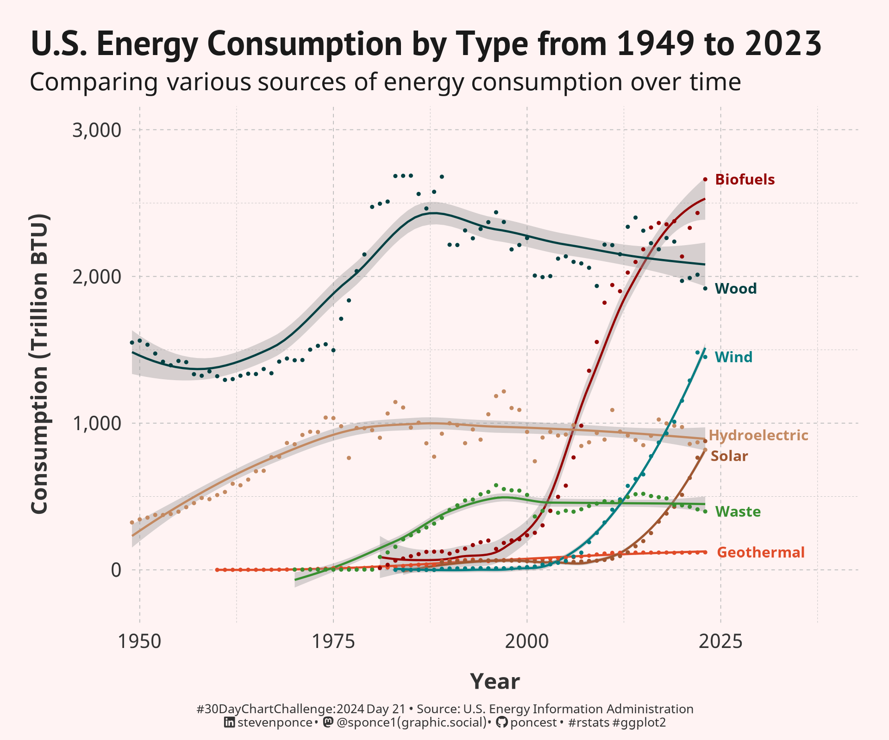

# #30DayChartChallenge

## 2024 - April (#rstats edition)

## Topics:

|                                                                                                                                                                                          |                                                                                                                                                                                                              |                                                                                                                                                                                            |                                                                                                                                                                                                        |
|------------------|-------------------|------------------|------------------|
| [Day 01](https://github.com/poncest/30DayChartChallenge/tree/main/2024/day_01) [Comparisons \| part-to-whole](https://github.com/poncest/30DayChartChallenge/tree/main/2024/day_01)   | [Day 02](https://github.com/poncest/30DayChartChallenge/tree/main/2024/day_02) [Comparisons \| neo](https://github.com/poncest/30DayChartChallenge/tree/main/2024/day_02)                                 | [Day 03](https://github.com/poncest/30DayChartChallenge/tree/main/2024/day_03) [Comparisons \| makeover](https://github.com/poncest/30DayChartChallenge/tree/main/2024/day_03)          | [Day 04](https://github.com/poncest/30DayChartChallenge/tree/main/2024/day_04) [Comparisons \| waffle](https://github.com/poncest/30DayChartChallenge/tree/main/2024/day_04)                        |
|                                                                                                                                               |                                                                                                                                                                             |                                                                                                                                                        |                                                                                                                                                                    |
| [Day 05](https://github.com/poncest/30DayChartChallenge/tree/main/2024/day_05) [Comparisons \| diverging](https://github.com/poncest/30DayChartChallenge/tree/main/2024/day_05)       | [Day 06](https://github.com/poncest/30DayChartChallenge/tree/main/2024/day_06) [Comparisons \| OECD (data day)](https://github.com/poncest/30DayChartChallenge/tree/main/2024/day_06)                     | [Day 07](https://github.com/poncest/30DayChartChallenge/tree/main/2024/day_07) [Distributions \| hazards](https://github.com/poncest/30DayChartChallenge/tree/main/2024/day_07)         | [Day 08](https://github.com/poncest/30DayChartChallenge/tree/main/2024/day_08) [Distributions \| circular](https://github.com/poncest/30DayChartChallenge/tree/main/2024/day_08)                    |
|                                                                                                                                                   | ")                                                                                                                                                                |                                                                                                                                                       |                                                                                                                                                                  |
| [Day 09](https://github.com/poncest/30DayChartChallenge/tree/main/2024/day_09) [Distributions \| major/minor](https://github.com/poncest/30DayChartChallenge/tree/main/2024/day_09)   | [Day 10](https://github.com/poncest/30DayChartChallenge/tree/main/2024/day_10) [Distributions \| physical](https://github.com/poncest/30DayChartChallenge/tree/main/2024/day_10)                          | [Day 11](https://github.com/poncest/30DayChartChallenge/tree/main/2024/day_11) [Distributions \| mobile-friendly](https://github.com/poncest/30DayChartChallenge/tree/main/2024/day_11) | [Day 12](https://github.com/poncest/30DayChartChallenge/tree/main/2024/day_12) [Distributions \| Reuters Graphic (theme day)](https://github.com/poncest/30DayChartChallenge/tree/main/2024/day_12) |
|                                                                                                                                                 |                                                                                                                                                                        |                                                                                                                                               | ")                                                                                                                                             |
| [Day 13](https://github.com/poncest/30DayChartChallenge/tree/main/2024/day_13) [Relationships \| family](https://github.com/poncest/30DayChartChallenge/tree/main/2024/day_13)        | [Day 14](https://github.com/poncest/30DayChartChallenge/tree/main/2024/day_14) [Relationships \| heatmap](https://github.com/poncest/30DayChartChallenge/tree/main/2024/day_14)                           | [Day 15](https://github.com/poncest/30DayChartChallenge/tree/main/2024/day_15) [Relationships \| historical](https://github.com/poncest/30DayChartChallenge/tree/main/2024/day_15)      | [Day 16](https://github.com/poncest/30DayChartChallenge/tree/main/2024/day_16) [Relationships \| weather](https://github.com/poncest/30DayChartChallenge/tree/main/2024/day_16)                     |
|                                                                                                                                                      |                                                                                                                                                                         |                                                                                                                                                    |                                                                                                                                                                   |
| [Day 17](https://github.com/poncest/30DayChartChallenge/tree/main/2024/day_17) [Relationships \| networks](https://github.com/poncest/30DayChartChallenge/tree/main/2024/day_17)      | [Day 18](https://github.com/poncest/30DayChartChallenge/tree/main/2024/day_18) [Relationships \| Asian Development Bank (data day)](https://github.com/poncest/30DayChartChallenge/tree/main/2024/day_18) | [Day 19](https://github.com/poncest/30DayChartChallenge/tree/main/2024/day_19) [Timeseries \| dinosaurs](https://github.com/poncest/30DayChartChallenge/tree/main/2024/day_19)          | [Day 20](https://github.com/poncest/30DayChartChallenge/tree/main/2024/day_20) [Timeseries \| correlation](https://github.com/poncest/30DayChartChallenge/tree/main/2024/day_20)                    |
|                                                                                                                                                    | ")                                                                                                                                                                 |                                                                                                                                                     |                                                                                                                                                               |
| [Day 21](https://github.com/poncest/30DayChartChallenge/tree/main/2024/day_21) [Timeseries \| green energy](https://github.com/poncest/30DayChartChallenge/tree/main/2024/day_21)     | [Day 22](https://github.com/poncest/30DayChartChallenge/tree/main/2024/day_22) [Timeseries \| mobility](https://github.com/poncest/30DayChartChallenge/tree/main/2024/day_22)                             | [Day 23](https://github.com/poncest/30DayChartChallenge/tree/main/2024/day_23) [Timeseries \| tiles](https://github.com/poncest/30DayChartChallenge/tree/main/2024/day_23)              | [Day 24](https://github.com/poncest/30DayChartChallenge/tree/main/2024/day_24) [Timeseries \| ILO Africa Region (data day)](https://github.com/poncest/30DayChartChallenge/tree/main/2024/day_24)   |
|                                                                                                                                                |                                                                                                                                                                        |                                                                                                                                                         | ")                                                                                                                                             |
| [Day 25](https://github.com/poncest/30DayChartChallenge/tree/main/2024/day_25) [Uncertainties \| global change](https://github.com/poncest/30DayChartChallenge/tree/main/2024/day_25) | [Day 26](https://github.com/poncest/30DayChartChallenge/tree/main/2024/day_26) [Uncertainties \| ai](https://github.com/poncest/30DayChartChallenge/tree/main/2024/day_26)                                | [Day 27](https://github.com/poncest/30DayChartChallenge/tree/main/2024/day_27) [Uncertainties \| good/bad](https://github.com/poncest/30DayChartChallenge/tree/main/2024/day_27)        | [Day 28](https://github.com/poncest/30DayChartChallenge/tree/main/2024/day_28) [Uncertainties \| trend](https://github.com/poncest/30DayChartChallenge/tree/main/2024/day_28)                       |
|                                                                                                                                               |                                                                                                                                                                              |                                                                                                                                                      |                                                                                                                                                                     |
|                                                                                                                                                                                          |                                                                                                                                                                                                              |                                                                                                                                                                                            |                                                                                                                                                                                                        |
|                                                                                                                                                                                          |                                                                                                                                                                                                              |                                                                                                                                                                                            |                                                                                                                                                                                                        |
