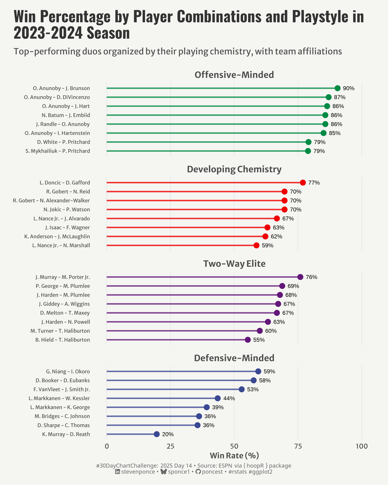

# #30DayChartChallenge

## 2024 - April (#rstats edition)

## Topics:

## Summary:

## Charts by Category:

|  |  |  |  |
|------------------|------------------|------------------|------------------|
| [Day 01](https://github.com/poncest/30DayChartChallenge/tree/main/2025/day_01) [Comparisons \| fractions](https://github.com/poncest/30DayChartChallenge/tree/main/2025/day_01) | [Day 02](https://github.com/poncest/30DayChartChallenge/tree/main/2025/day_02) [Comparisons \| slope](https://github.com/poncest/30DayChartChallenge/tree/main/2025/day_02) | [Day 03](https://github.com/poncest/30DayChartChallenge/tree/main/2025/day_03) [Comparisons \| circular](https://github.com/poncest/30DayChartChallenge/tree/main/2025/day_03) | [Day 04](https://github.com/poncest/30DayChartChallenge/tree/main/2025/day_04) [Comparisons \| big or small](https://github.com/poncest/30DayChartChallenge/tree/main/2025/day_04) |
|  |  |  |  |
| [Day 05](https://github.com/poncest/30DayChartChallenge/tree/main/2025/day_05) [Comparisons \| rank](https://github.com/poncest/30DayChartChallenge/tree/main/2025/day_05) | Day 06 | [Day 07](https://github.com/poncest/30DayChartChallenge/tree/main/2025/day_07) [Distributions \| outliers](https://github.com/poncest/30DayChartChallenge/tree/main/2025/day_07) | [Day 08](https://github.com/poncest/30DayChartChallenge/tree/main/2025/day_08) [Distributions \| histograms](https://github.com/poncest/30DayChartChallenge/tree/main/2025/day_08) |
|  |  |  |  |
| [Day 09](https://github.com/poncest/30DayChartChallenge/tree/main/2025/day_09) [Distributions \| diverging](https://github.com/poncest/30DayChartChallenge/tree/main/2025/day_09) | [Day 10](https://github.com/poncest/30DayChartChallenge/tree/main/2025/day_10) [Distributions \| multi-modal](https://github.com/poncest/30DayChartChallenge/tree/main/2025/day_10) | [Day 11](https://github.com/poncest/30DayChartChallenge/tree/main/2025/day_11) [Distributions \| stripes](https://github.com/poncest/30DayChartChallenge/tree/main/2025/day_11) | Day 12 |
|  |  |  |  |
| [Day 13](https://github.com/poncest/30DayChartChallenge/tree/main/2025/day_13) [Distributions \| cluster](https://github.com/poncest/30DayChartChallenge/tree/main/2025/day_13) | [Day 14](https://github.com/poncest/30DayChartChallenge/tree/main/2025/day_14) [Distributions \| kinship](https://github.com/poncest/30DayChartChallenge/tree/main/2025/day_14) | [Day 15](https://github.com/poncest/30DayChartChallenge/tree/main/2025/day_15) [Distributions \| complicated](https://github.com/poncest/30DayChartChallenge/tree/main/2025/day_15) | [Day 16](https://github.com/ponest/30DayChartChallenge/tree/main/2025/day_16) [Distributions \| negative](https://github.com/poncest/30DayChartChallenge/tree/main/2025/day_16) |
|  |  |  |  |
|  |  |  |  |
|  |  |  |  |
|  |  |  |  |
|  |  |  |  |
|  |  |  |  |
|  |  |  |  |
|  |  |  |  |
|  |  |  |  |
