# #30DayChartChallenge

## 2026 - April (#rstats edition)

## Topics:

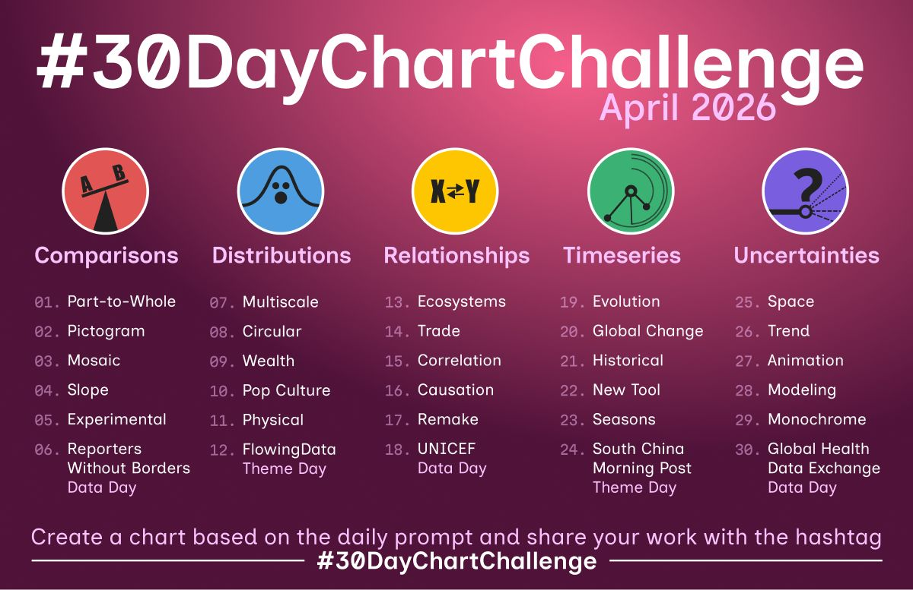

## Charts by Category:

|  |  |  |  |
|------------------|------------------|------------------|------------------|
| [Day 01](https://github.com/poncest/30DayChartChallenge/tree/main/2026/day_01) [Comparisons \| Part-to-Whole](https://github.com/poncest/30DayChartChallenge/tree/main/2026/day_01) | [Day 02](https://github.com/poncest/30DayChartChallenge/tree/main/2026/day_02) [Comparisons \| Pictogram](https://github.com/poncest/30DayChartChallenge/tree/main/2026/day_02) | [Day 03](https://github.com/poncest/30DayChartChallenge/tree/main/2026/day_03) [Comparisons \| Mosaic](https://github.com/poncest/30DayChartChallenge/tree/main/2026/day_03) | [Day 04](https://github.com/poncest/30DayChartChallenge/tree/main/2026/day_04) [Comparisons \| Slope](https://github.com/poncest/30DayChartChallenge/tree/main/2026/day_04) |
| 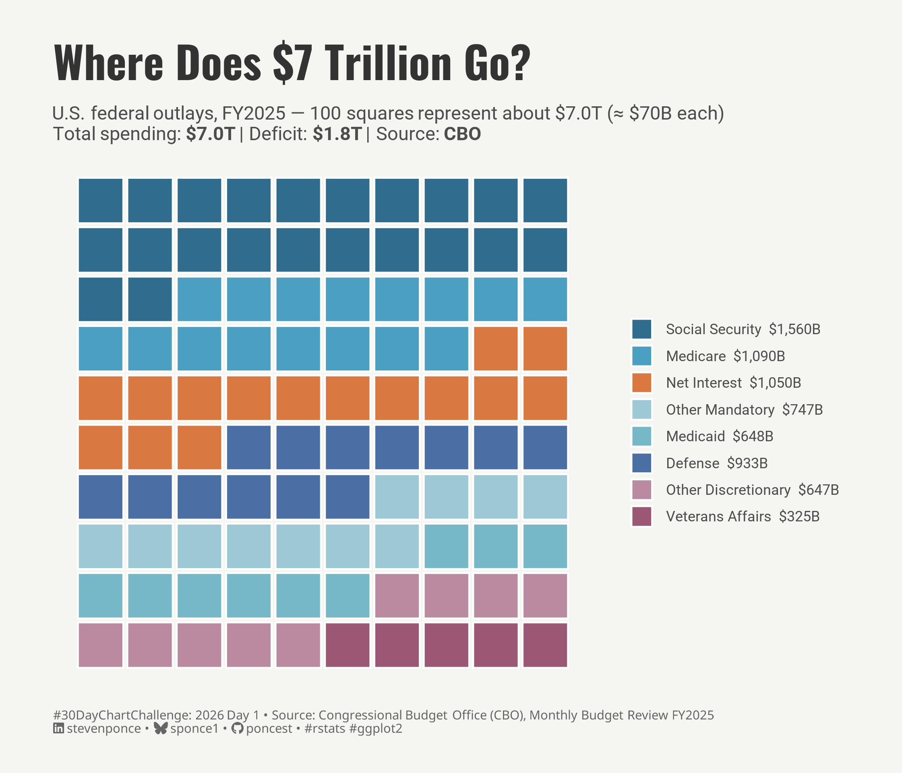 | 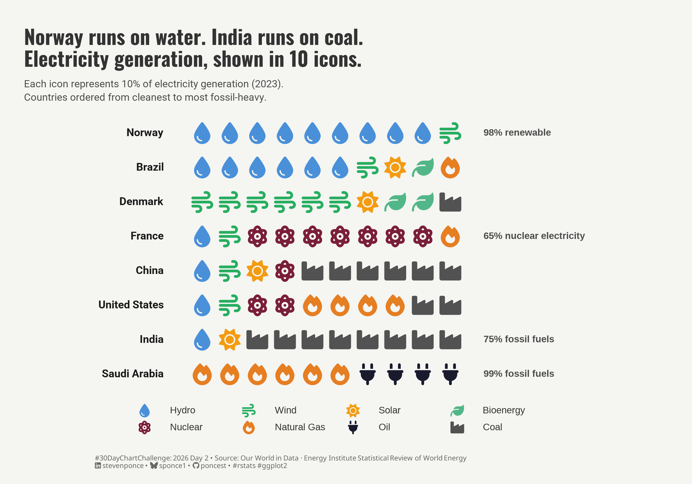 | 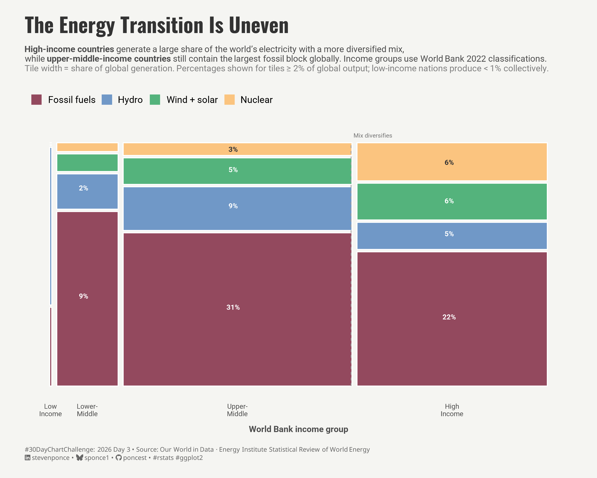 |  |
| [Day 05](https://github.com/poncest/30DayChartChallenge/tree/main/2026/day_05) [Comparisons \| Experimental](https://github.com/poncest/30DayChartChallenge/tree/main/2026/day_05) | [Day 06](https://github.com/poncest/30DayChartChallenge/tree/main/2026/day_06) [Comparisons \| Data Day — Reporters Without Borders](https://github.com/poncest/30DayChartChallenge/tree/main/2026/day_06) | [Day 07](https://github.com/poncest/30DayChartChallenge/tree/main/2026/day_07) [Distributions \| Multiscale](https://github.com/poncest/30DayChartChallenge/tree/main/2026/day_07) | [Day 08](https://github.com/poncest/30DayChartChallenge/tree/main/2026/day_08) [Distributions \| Circular](https://github.com/poncest/30DayChartChallenge/tree/main/2026/day_08) |
| 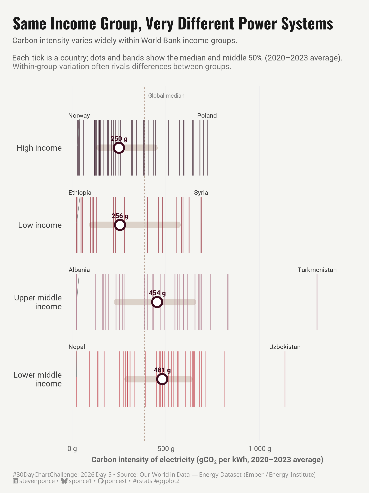 |  | 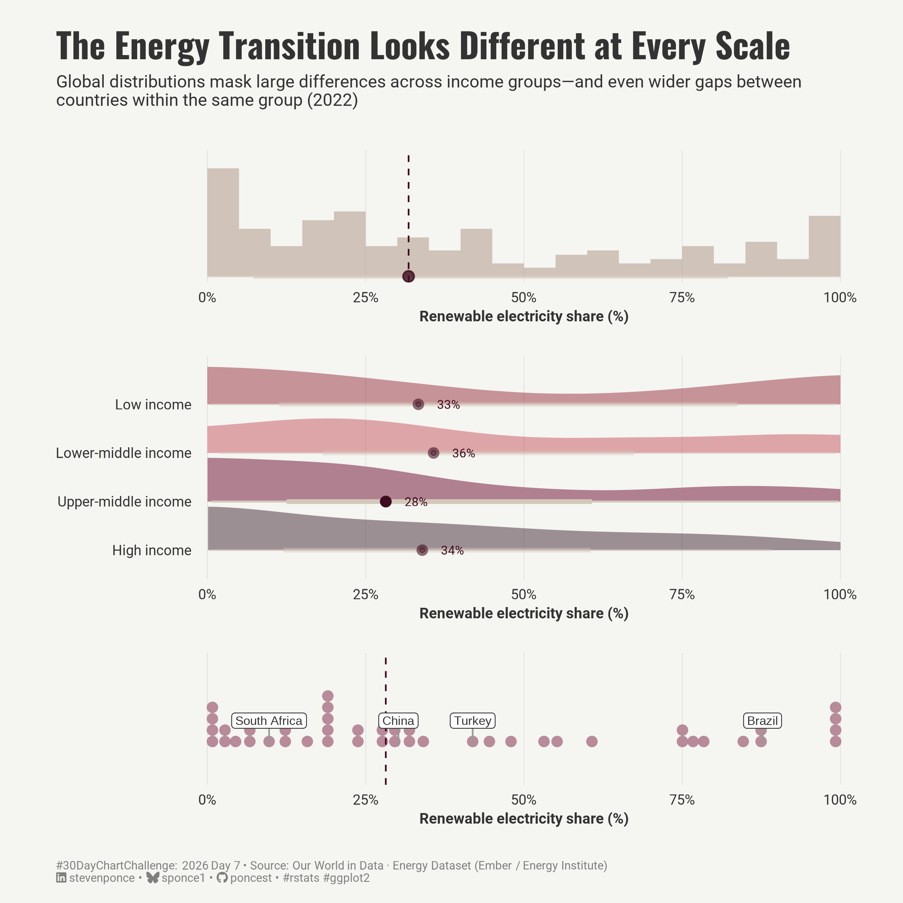 |  |
| [Day 09](https://github.com/poncest/30DayChartChallenge/tree/main/2026/day_09) [Distributions \| Wealth](https://github.com/poncest/30DayChartChallenge/tree/main/2026/day_09) | [Day 10](https://github.com/poncest/30DayChartChallenge/tree/main/2026/day_10) [Distributions \| Pop Culture](https://github.com/poncest/30DayChartChallenge/tree/main/2026/day_10) | [Day 11](https://github.com/poncest/30DayChartChallenge/tree/main/2026/day_11) [Distributions \| Physical](https://github.com/poncest/30DayChartChallenge/tree/main/2026/day_11) | [Day 12](https://github.com/poncest/30DayChartChallenge/tree/main/2026/day_12) [Distributions \| Theme Day — Flowing Data](https://github.com/poncest/30DayChartChallenge/tree/main/2026/day_12) |
|  | 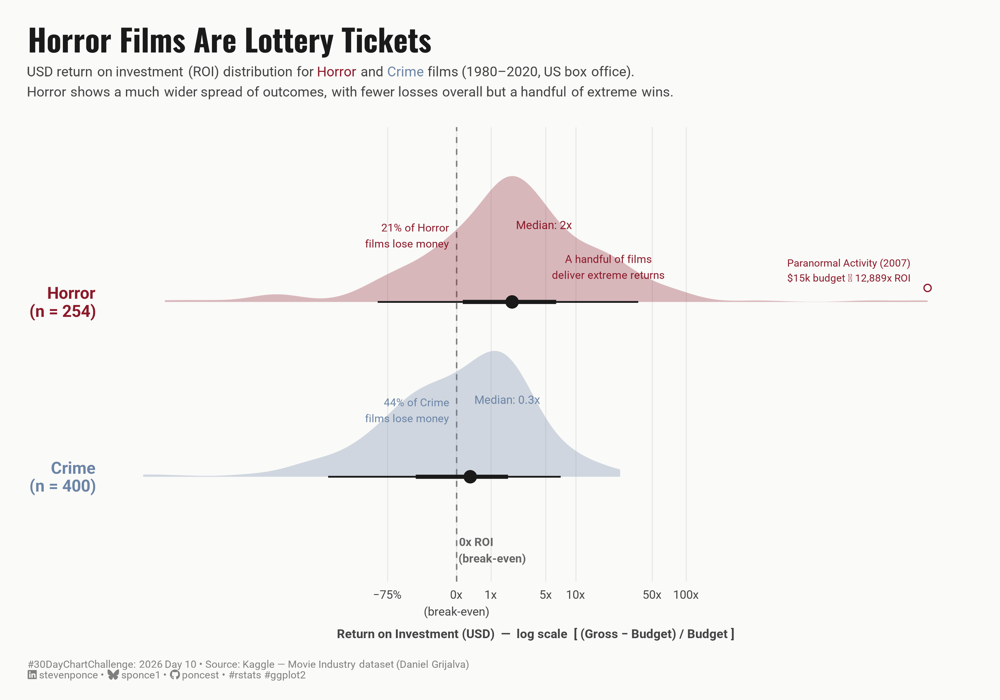 |  | 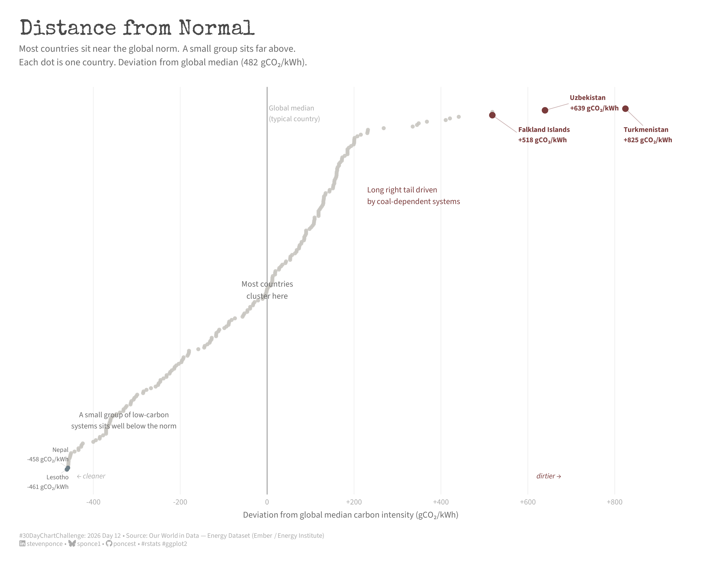 |
| [Day 13](https://github.com/poncest/30DayChartChallenge/tree/main/2026/day_13) [Relationships \| Ecosystems](https://github.com/poncest/30DayChartChallenge/tree/main/2026/day_13) | [Day 14](https://github.com/poncest/30DayChartChallenge/tree/main/2026/day_14) [Relationships \| Trade](https://github.com/poncest/30DayChartChallenge/tree/main/2026/day_14) | [Day 15](https://github.com/poncest/30DayChartChallenge/tree/main/2026/day_15) [Relationships \| Correlation](https://github.com/poncest/30DayChartChallenge/tree/main/2026/day_15) | [Day 16](https://github.com/poncest/30DayChartChallenge/tree/main/2026/day_16) [Relationships \| Causation](https://github.com/poncest/30DayChartChallenge/tree/main/2026/day_16) |
| 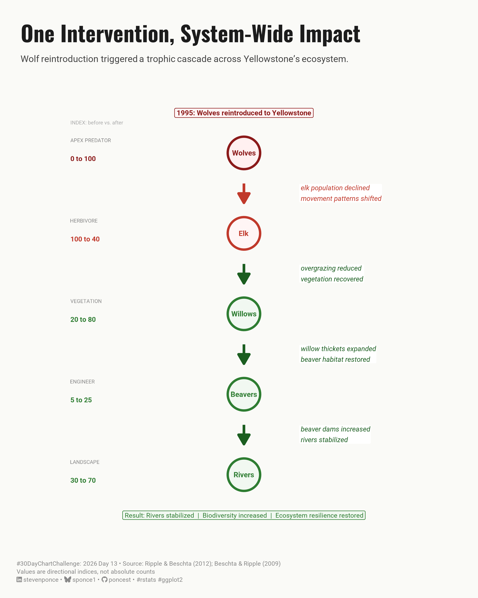 |  | 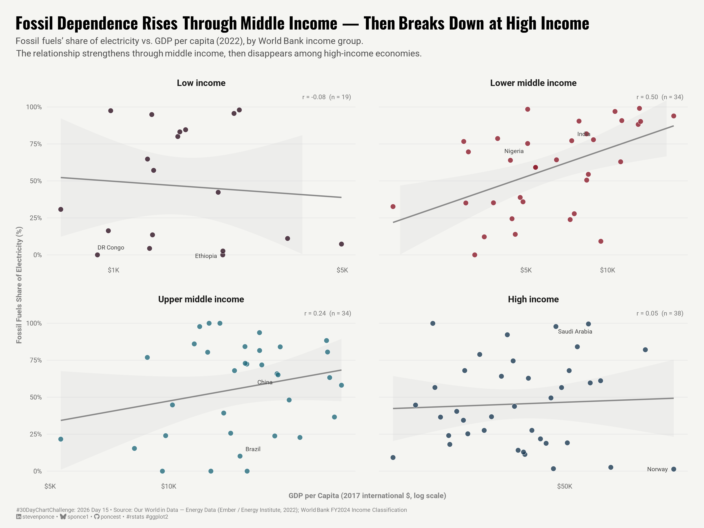 |  |
| [Day 17](https://github.com/poncest/30DayChartChallenge/tree/main/2026/day_17) [Relationships \| Remake](https://github.com/poncest/30DayChartChallenge/tree/main/2026/day_17) | [Day 18](https://github.com/poncest/30DayChartChallenge/tree/main/2026/day_18) [Relationships \| Data Day — UNICEF](https://github.com/poncest/30DayChartChallenge/tree/main/2026/day_18) | [Day 19](https://github.com/poncest/30DayChartChallenge/tree/main/2026/day_19) [Timeseries \| Evolution](https://github.com/poncest/30DayChartChallenge/tree/main/2026/day_19) | [Day 20](https://github.com/poncest/30DayChartChallenge/tree/main/2026/day_20) [Timeseries \| Global change](https://github.com/poncest/30DayChartChallenge/tree/main/2026/day_20) |
| 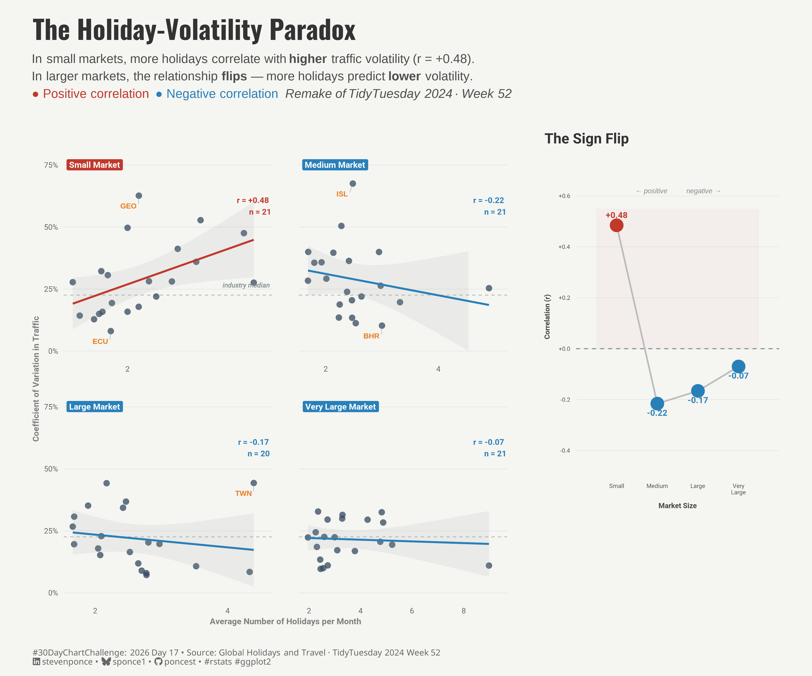 |  |  | 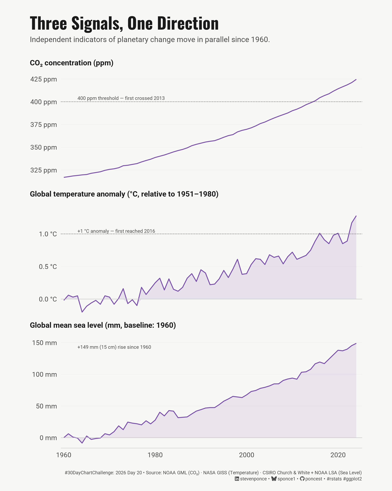 |
| [Day 21](https://github.com/poncest/30DayChartChallenge/tree/main/2026/day_21) [Timeseries \| Historical](https://github.com/poncest/30DayChartChallenge/tree/main/2026/day_21) | [Day 22](https://github.com/poncest/30DayChartChallenge/tree/main/2026/day_21) [Timeseries \| Historical](https://github.com/poncest/30DayChartChallenge/tree/main/2026/day_22) | [Day 23](https://github.com/poncest/30DayChartChallenge/tree/main/2026/day_21) [Timeseries \| Historical](https://github.com/poncest/30DayChartChallenge/tree/main/2026/day_23) | [Day 24](https://github.com/poncest/30DayChartChallenge/tree/main/2026/day_24) [Timeseries \| Theme Day — SCMP](https://github.com/poncest/30DayChartChallenge/tree/main/2026/day_24) |
|  |  | 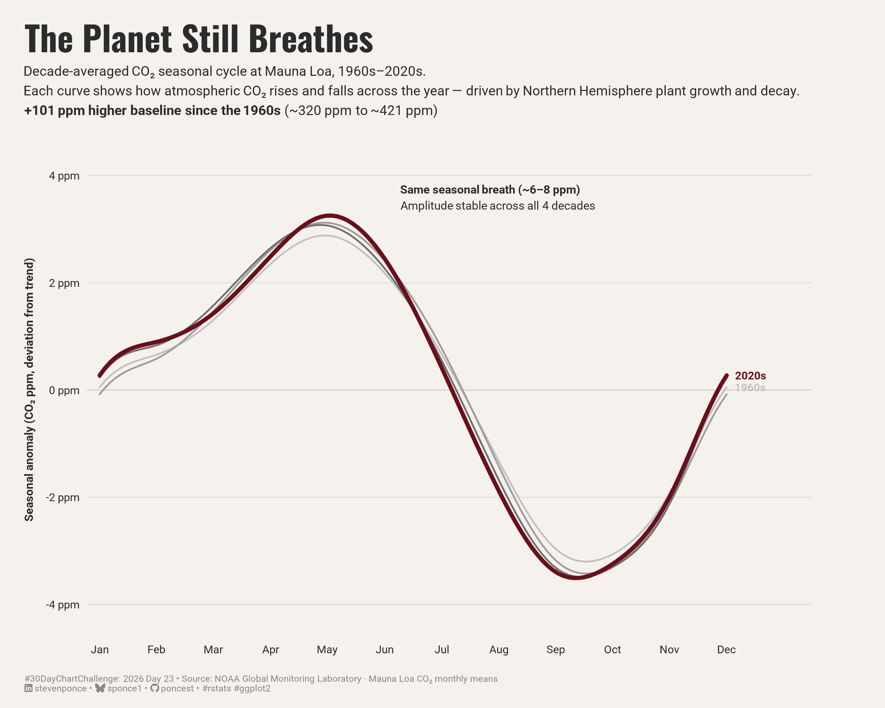 |  |
| [Day25](https://github.com/poncest/30DayChartChallenge/tree/main/2026/day_25) [Uncertainties \| Space](https://github.com/poncest/30DayChartChallenge/tree/main/2026/day_25) | [Day 26](https://github.com/poncest/30DayChartChallenge/tree/main/2026/day_26) [Uncertainties \| Trend](https://github.com/poncest/30DayChartChallenge/tree/main/2026/day_26) | [Day 27](https://github.com/poncest/30DayChartChallenge/tree/main/2026/day_27) [Uncertainties \| Animation](https://github.com/poncest/30DayChartChallenge/tree/main/2026/day_27) | [Day 28](https://github.com/poncest/30DayChartChallenge/tree/main/2026/day_28) [Uncertainties \| Modeling](https://github.com/poncest/30DayChartChallenge/tree/main/2026/day_28) |
|  | 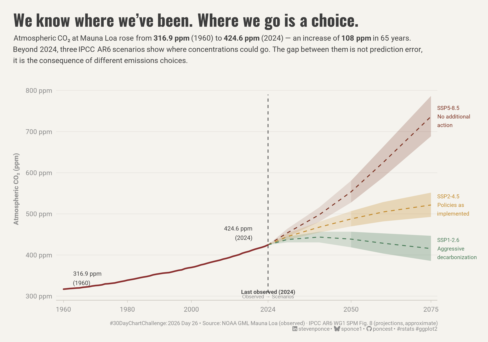 | 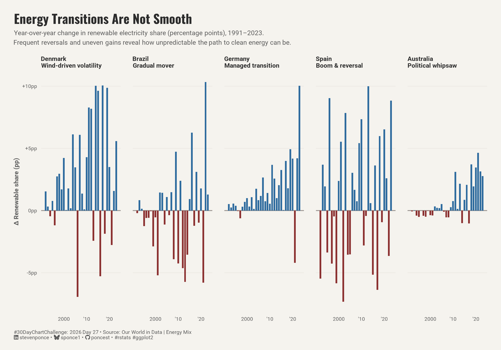 | 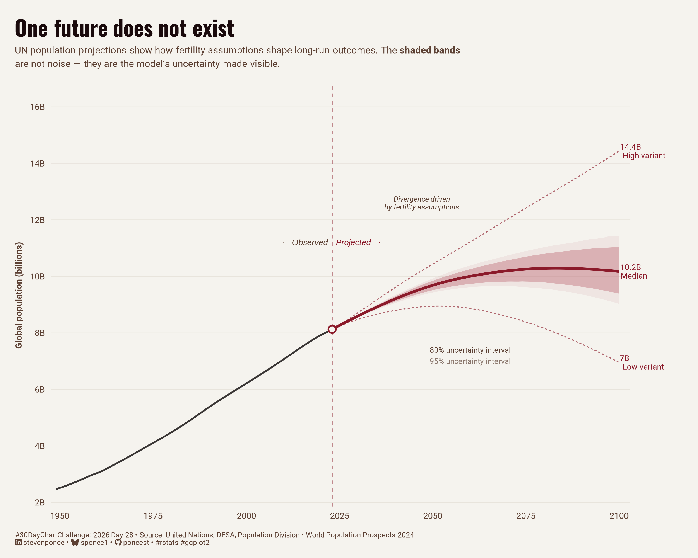 |
| [Day 29](https://github.com/poncest/30DayChartChallenge/tree/main/2026/day_29) [Uncertainties \| Monochrome](https://github.com/poncest/30DayChartChallenge/tree/main/2026/day_29) | [Day 30](https://github.com/poncest/30DayChartChallenge/tree/main/2026/day_30) [Uncertainties \| Data Day — Global Health Data Exchange](https://github.com/poncest/30DayChartChallenge/tree/main/2026/day_30) |  |  |
| 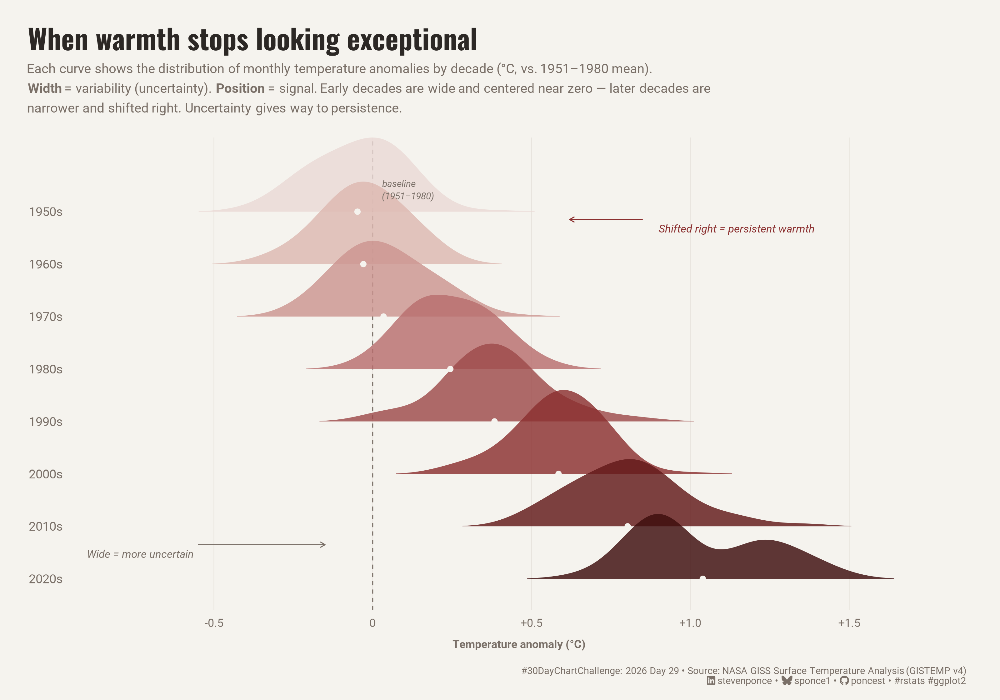 | 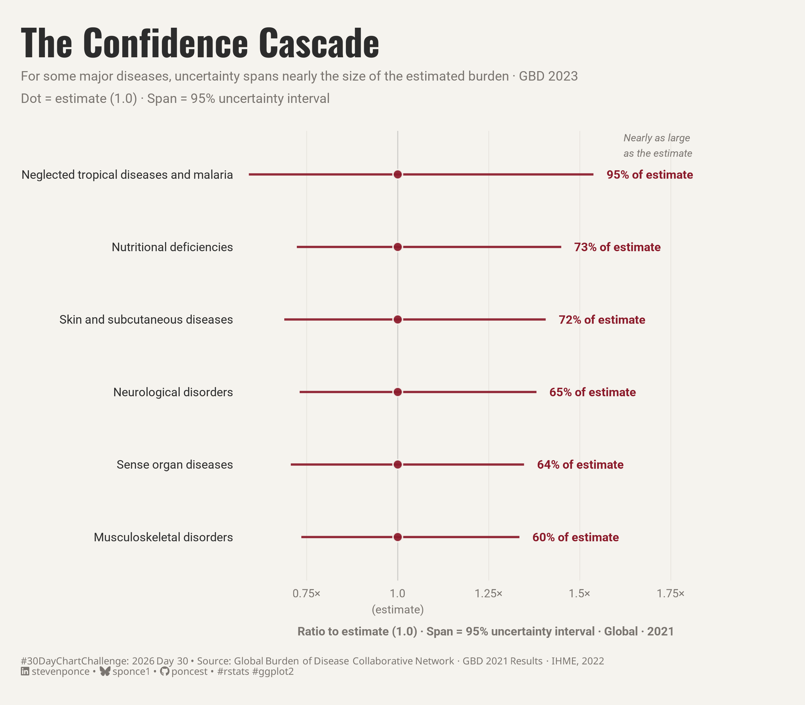 |  |  |
